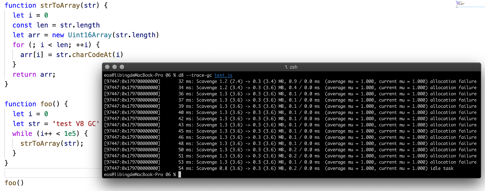

# markdown 语法

[TOC]
生成目录，只能放在一级标题前。标题后面添加 `{ignore=true}`可排除一个标题。
使用code_chunk，在文档开头添加如下代码
<!-- @import "[TOC]" {cmd="toc" depthFrom=2 depthTo=3 orderedList=false} -->

<!-- code_chunk_output -->

- [二级标题](#二级标题)

<!-- /code_chunk_output -->

# 一级标题
## 二级标题

> 1级引用
>> 2级引用

```javascript {.line-numbers}
// 我是代码块
function a() {
  rrturn 'a';
}
```

1. 有序列表项1
1. 有序列表项2
3. 有序列表项3
    - 无序列表
    * 无序列表
    + 无序列表

- [ ] 任务一 未做任务 `- + 空格 + [ ]`
- [x] 任务二 已做任务 `- + 空格 + [x]`

名词
: 我是名词的解释

**粗体**  __粗体__
*斜体* _斜体_

|列1|列2|列3|列4|
|--:|:---|---:|--|
|我是右对齐|左对齐|横线数要大于1|
|值1|值2|

---

***
* * *
分割线：至少要三个-或者*

[我是链接名](链接的URL "标题")

[链接名][1]

[1]:www.baidu.com "百度啦"
中间必须有空行




反斜杠显示\*

<center>行中心对齐</center>
<p align="left">行左对齐</p>
<p align="right">行右对齐</p>

空格
&emsp; 或 &#8195; //全角
&ensp; 或 &#8194; //半角
&nbsp; 或 &#160; //半角之半角


我是注脚1[^1]，我是注脚2[^2]。注脚会自动放到底部，注脚之间需要空行。

[^1]:注脚1的注脚

[^2]:注脚2的注脚


~~删除线~~

Tags: 标签1 标签2

*[缩略]: 全称

==背景高亮==

[跳转到锚点](#id)

<span id="id">跳到这里</span>


链接和邮箱：
<12345@qq.com>
<http://www.baidu.com>

<i>斜体</i>
<b>粗体</b>
<em>强调，效果同斜体</em>
A<sup>b</sup>
A<sub>b</sub>
<kbd>按键效果</kbd>

Markdown公式可看[这里](https://www.zybuluo.com/codeep/note/163962)和[这里](https://www.cnblogs.com/q735613050/p/7253073.html)

引入（可引入任意文件）
@import "./images/图解GoogleV8/查看垃圾回收.png"


使用[emoji](https://www.webfx.com/tools/emoji-cheat-sheet/)
:+1::smile:

需要执行命令`Markdown Preview Enhanced: Run Code Chunk`
```JavaScript {cmd="D:\\software\\技术\\node\\node.exe", class="line-number"}
console.log("在md中运行代码");
```

流程图
```flow
st=>start: 开始
e=>end
op=>operation: 我是操作
cond=>condition: 我是条件

st->op->cond
cond(yes)->e
cond(no)->op
```

时序图
```sequence
小明->小红: 你好，吃饭了吗？
Note right of 小红: 想了一下
小红->小明: 我吃饱啦
```

[幻灯片用法](https://www.bookstack.cn/read/mpe/zh-cn-presentation.md)

