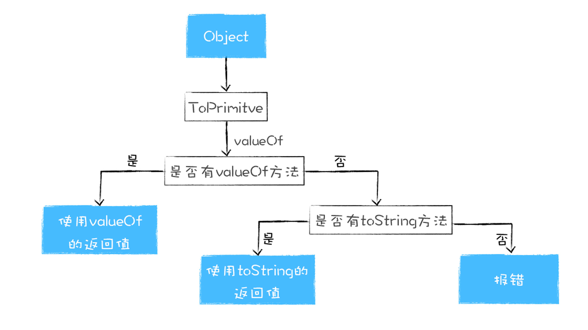
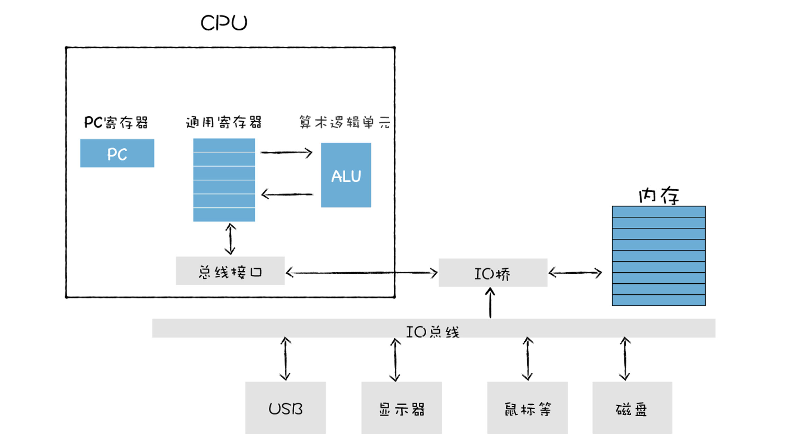
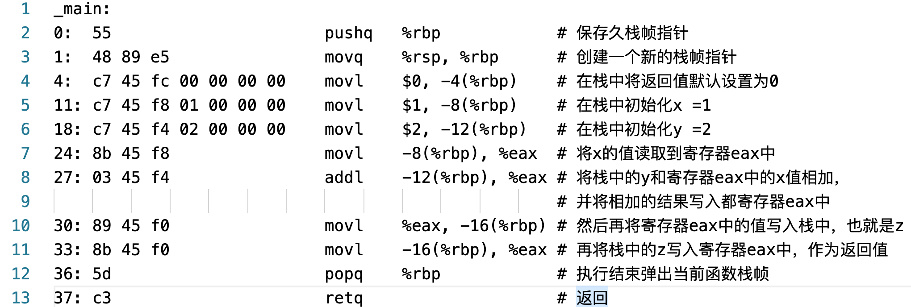
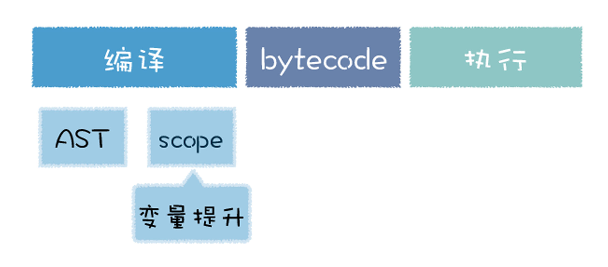

# 图解Google V8笔记

## 开篇词：如何学习V8

### 如何学习V8？
先了解 JavaScript 这门语言的基本特性和设计思想，再学习V8执行 JavaScript 代码的完整流程。

## 1. V8是如何执行一段JavaScript代码的？

### 什么是V8？
V8 是由 Google 开发的开源 JavaScript 引擎，也被称为虚拟机，模拟实际计算机各种功能来实现代码的编译和执行。

### 高级代码为什么需要先编译再执行？
CPU 具有指令集（机器语言）用于实现各种功能，但是只能识别二进制的指令，不能直接识别由高级语言所编写的代码。有两种方式可以执行高级代码。  
1. 解释执行
  - 先将输入的源代码通过解析器编译成中间代码，之后直接使用解释器解释执行中间代码，然后直接输出结果。
  - 特点：启动速度快，执行时速度慢
2. 编译执行
  - 先将源代码转换为中间代码，然后编译器再将中间代码编译成机器代码并保存，在需要执行时直接执行。
  - 特点：启动速度慢，执行时的速度快

### V8 是怎么执行 JavaScript 代码的？
V8 使用即时编译技术（Just In Time），即混合编译执行和解释执行这两种手段。流程如下：
1. 初始化执行环境，包括“堆和栈空间”、“全局执行上下文”、“全局作用域”、“事件循环系统”等。
2. 解析（结构化）源代码，生成AST、作用域。
3. 解释器依据AST、作用域生成字节码，按照顺序解释字节码。
4. 监听热点代码。
    1. 重复多次执行的一段代码会被标记为热点代码
    2. 优化编译器将该段代码字节码编译为二进制代码并优化代码
    3. 该代码重复被执行时直接执行优化的二进制代码
    4. 执行过程中，如果对象的结构被动态修改了，优化代码无效。优化编译器执行反优化操作，经过反优化的代码下次执行时回退到解释器解释执行。


### 跟踪一段实际代码的执行流程
新建如下JS文件，并使用 D8 执行命令
```JavaScript
// test.js
var test = 'GeekTime'
```
```shell
# 命令
d8 --print-ast test.js # 查看AST
d8 --print-scopes test.js # 查看作用域
d8 --print-bytecode test.js # 生成字节码
d8 --trace-opt test.js # 查看优化的代码
pt --trace-deopt test.js # 查看反优化的代码
```

### 思考题：除了 V8 采用了 JIT 技术，还有哪些虚拟机采用了 JIT 技术？
JVM以及luajit，包括oracle最新的graalVM都已经采用了JIT技术。

### 评论补充：安装 js 引擎
1. mac使用 jsvu
    1. 全局安装 jsvu： `npm install jsvu -g`
    2. 将~/.jsvu路径添加到系统环境变量中：`export PATH="${HOME}/.jsvu:${PATH}"`
    3. 可以直接通过命令参数指定：`jsvu --os=mac64 --engines=v8-debug`。
2. mac使用brew install v8


## 2. 函数即对象：JavaScript的函数特点
如果某个编程语言的函数，可以和这个语言的数据类型做一样的事情，我们就把这个语言中的函数称为一等公民。在 JavaScript 中，函数是一等公民。

### 函数的本质
函数是一种特殊的对象，它和对象一样可以拥有属性和值，但是函数和普通对象不同的是，函数可以被调用。

### V8 内部是怎么实现函数可调用特性的呢？
在 V8 内部，会为函数对象添加了两个隐藏属性，分别是 name 属性和 code 属性。name 属性的值就是函数名称，name 的默认属性值是 anonymous，表示函数对象没有被设置名称。code 属性代表函数代码，以字符串形式存储在内存中。当执行到该函数时，V8 会取出 code 属性值再解释执行。

### 函数关联了哪些内容
- 基础的属性和值
- 相关的执行上下文

### 思考题：哪些语言天生支持“函数是一等公民”？
kotlin和go、Python、Dart

## 3. 快属性和慢属性：V8是怎样提升对象属性访问速度的？

### 常规属性和排序属性
在 V8 内部，为了有效地提升存储和访问这两种属性的性能，分别使用了两个线性数据结构来分别保存排序属性和常规属性。
- 排序属性：数字属性，在V8 中称为element，按照索引值大小升序排列。
- 常规属性：字符串属性，在 V8 中被称为 properties，根据创建时的顺序升序排列。


为了优化在查找元素时，需要先找到 properties 对象才能找到对应的属性，多了一步操作而影响元素查找效率的问题，部分常规属性直接存储到对象本身，即对象内属性 (in-object properties)。对象内属性的数量是固定的，默认是 10 个，如果添加的属性超出了对象分配的空间，则它们将被保存在常规属性存储中。


### 快属性和慢属性
V8 具有快属性和慢属性两种存储策略，如果一个对象的属性过多时，V8 就会采取“慢属性”策略。
- 快属性：保存在线性数据结构中的属性。访问速度快，添加或者删除执行效率低，会产生大量时间和内存开销。
- 慢属性：保存在属性字典（hash表）中的属性。


### 实践：在 Chrome 中查看对象布局
控制台执行以下代码->->Memory->左侧的小圆圈（take heap snapshot）->搜索Foo，查看系统快照。  
```JavaScript
function Foo(property_num, element_num) {
  //添加可索引属性
  for (let i = 0; i < element_num; i++) {
    this[i] = `element${i}`
  }
  //添加常规属性
  for (let i = 0; i < property_num; i++) {
    let ppt = `property${i}`
    this[ppt] = ppt
  }
}
var bar = new Foo(10, 10)
var bar2 = new Foo(20,10)
var bar3 = new Foo(500,10)
```
观察系统快照，除了 elements 和 properties 属性，V8 还为每个对象实现了 map 属性和`__proto__`属性。`__proto__`属性就是原型，是用来实现 JavaScript 继承的，map 则是隐藏类。

### 思考：结合文中介绍的快属性和慢属性，给出不建议使用 delete 的原因
如果删除属性在线性结构中，删除后需要移动元素，开销较大。
如果删除属性在慢属性中，可能需要将慢属性重排到快属性。

### 补充材料
[补充材料](https://www.cnblogs.com/chargeworld/p/12236848.html)

## 4. 函数表达式

### 函数声明与函数表达式的差异
这两种定义函数的方式具有不同语义，不同的语义触发了不同的行为。
```JavaScript
// 函数声明
function foo(){
  return 1
}
// 函数表达式
foo = function (){
  console.log('foo')
}
```

### V8 是怎么处理函数声明的？
在变量提升阶段，V8 并不会执行赋值的表达式，该阶段只会分析基础的语句，比如变量的定义，函数的声明。
在编译阶段，如果解析到函数声明，那么 V8 会将生成函数对象，并将该对象提升到作用域中。如果解析到了某个变量声明，也会将其放到作用域中，但是会将其值设置为 undefined，表示该变量还未被使用。

### 立即调用的函数表达式（IIFE）
- 定义：因为小括号之间存放的必须是表达式，函数放在括号里就成了函数表达式，它会返回一个函数对象。如果我直接在表达式后面加上调用的括号，这就称为立即调用函数表达式（IIFE）。
- 作用：V8 在编译阶段，并不会为该表达式创建函数对象，所以不会污染环境。可用于封装一些变量、函数，可以起到变量隔离和代码隐藏的作用。
- 代码
```JavaScript
(function () {
    //statements
})()
```

## 5. 原型链：V8是如何实现对象继承的？
继承就是一个对象可以访问另外一个对象中的属性和方法。最典型的两种实现继承方式是**基于类的设计**和**基于原型继承**的设计。

### 基于类的设计和基于原型继承特点
基于原型继承：提供了非常复杂的规则，并提供了非常多的关键字，诸如 class、friend、protected、private、interface 等，通过组合使用这些关键字实现继承。
基于原型继承：省去了很多基于类继承时的繁文缛节，简洁优美。

### 原型和原型链（原型继承是如何实现的？）
V8 为每个对象都设置了一个 __proto__ 属性，该属性直接指向了该对象的原型对象，原型对象也有自己的 __proto__ 属性，这些属性串连在一起就成了原型链。每个对象都可以通过 __proto__ 属性直接访问其原型对象的方法或者属性。

### 不建议直接使用 __proto__ 属性访问/修改属性
- 这是隐藏属性，并不是标准定义的
- 使用该属性会造成严重的性能问题

### 构造函数是怎么创建对象的？（new函数做了什么？）
1. 创建了一个空白对象
2. 设置该对象的原型对象为构造函数的 prototype 属性
3. 以该对象为上下文调用构造函数（fun.call(instance)），并传入参数

### 构造函数怎么实现继承？
```JavaScript
function DogFactory(type,color){
    this.type = type
    this.color = color
}
DogFactory.prototype.constant_temperature = 1
var dog1 = new DogFactory('Dog','Black')
```

### 思考：DogFactory.prototype 和 DogFactory._proto_ 这两个属性之间有关联吗？
DogFactory 是 Function 构造函数的一个实例，所以 DogFactory.__proto__ === Function.prototype
DogFactory.prototype 是调用 Object 构造函数的一个实例，所以 DogFactory.prototype.__proto__ === Object.prototype
因此 DogFactory._proto_ 和 DogFactory.prototype 没有直接关系

## 6. 作用域链：V8是如何查找变量的？

### 什么是函数作用域和全局作用域？
- 定义：作用域就是存放变量和函数的地方，全局作用域中存放了全局环境中声明的变量和函数，函数作用域中存放了函数中声明的变量和函数。
- 区别：全局作用域是在 V8 启动过程中就创建了，且一直保存在内存中不会被销毁的，直至 V8 退出。 而函数作用域是在执行该函数时创建的，当函数执行结束之后，函数作用域就随之被销毁掉了。

### 作用域链是怎么工作的？
作用域链即作用域查找的路径，因为 JavaScript 是基于词法作用域（静态作用域）的，所以查找作用域的顺序是按照函数定义时的位置来决定的。
根据ECMAScript最新规范，函数对象有一个`[[Environment]]`内部属性，保存的是函数创建时当前正在执行的上下文环境，当函数被调用并创建执行上下文时会以`[[Environment]]`的值初始化作用域链，所以从规范也可以得知函数的作用域只跟函数创建时的当前上下文环境有关。

## 7. 类型转换：V8是怎么实现1+"2"的？

### 类型系统
在计算机科学中，类型系统（type system）用于定义如何将编程语言中的数值和表达式归类为许多不同的类型，如何操作这些类型，这些类型如何互相作用。

### V8 执行加法操作对象如何转换？
先调用对象的 valueOf 方法，如果没有 valueOf 方法，则调用 toString 方法，如果 vauleOf 和 toString 两个方法都不返回基本类型值，便会触发一个 TypeError 的错误。（string和date是例外，默认先调用toString）


## 8. 答疑：如何构建和使用V8的调试工具d8？
d8 是一个非常有用的调试工具，你可以把它看成是 debug for V8 的缩写。

### 如何通过 V8 的源码构建 D8？
1. 执行 `npm i jsvu -g`
2. 添加 .jsvu 的位置（windows用户在C:\Users\账号\.jsvu）系统环境变量的 Path
3. 执行 `jsvu`，选择自己的操作系统、需要安装的JS引擎（v8 或者 v8-debug）
4. 将 v8-debug 改名为 d8，即可运行第一节的命令行，否则命令中要使用v8-debug 替代 d8。如果使用 v8 运行需要把命令中的 d8 改为 v8。

### 如何使用 d8？
使用命令 `d8 --help` 查看所有命令、`d8 --help |grep print` 过滤查看打印命令。
windows环境需要下载[grep](https://sourceforge.net/projects/gnuwin32/files/grep/2.5.4/grep-2.5.4-setup.exe/download?use_mirror=managedway)，并配置环境变量

### 打印优化数据
在code文件夹中执行如下命令，运行结果如图
```shell
d8 --trace-opt-verbose 查看优化.js
```

图中可看到优化信息如下，第一行代表已经使用 TurboFan 优化编译器将函数 foo 优化成了二进制代码，第二行 V8 采取了 TurboFan 的 OSR(On-Stack Replacement) 优化，它是一种在运行时替换正在运行的函数的栈帧的技术，如果在 foo 函数中，V8 需要不断为 bar 函数创建栈帧，销毁栈帧，必会影响到 foo 函数的执行效率。于是，V8 采用了 OSR 技术，将 bar 函数和 foo 函数合并成一个新的函数。
```shell
<JSFunction foo (sfi = 0x2c730824fe21)> for optimized recompilation, reason: small function]
<JSFunction foo (sfi = 0xc9c0824fe21)> using TurboFan OSR]
```

### 查看垃圾回收
在code文件夹中执行如下命令，运行结果如图
```shell
d8 --trace-gc 查看垃圾回收.js
d8 --trace-gc 查看垃圾回收1.js
```


`Scavenge 1.2 (2.4) -> 0.3 (3.4) MB, 0.9 / 0.0 ms  (average mu = 1.000, current mu = 1.000) allocation failure`的意思是提示“Scavenge … 分配失败”，是因为垃圾回收器 Scavenge 所负责的空间已经满了，Scavenge 主要回收 V8 中“新生代”中的内存，大多数对象都是分配在新生代内存中，内存分配到新生代中是非常快速的，但是新生代的空间却非常小，通常在 1～8 MB 之间，一旦空间被填满，Scavenge 就会进行“清理”操作。

### 内部方法
V8 提供的一些内部方法，在启动 V8 时传入 allow-natives-syntax 命令即可使用，如下所示，可查看快属性：
```shell
d8 --allow-natives-syntax 检查快属性.js
```
其他内部方法可参考[这里](https://github.com/v8/v8/blob/4b9b23521e6fd42373ebbcb20ebe03bf445494f9/src/runtime/runtime.h)

### 思考：什么情况下，V8 会将多个函数合成一个函数？
频繁创建栈帧，销毁栈帧的时候（个人想法）

### 评论补充：编译好的d8工具
[mac平台](https://storage.googleapis.com/chromium-v8/official/canary/v8-mac64-dbg-8.4.109.zip)
[linux32平台](https://storage.googleapis.com/chromium-v8/official/canary/v8-linux32-dbg-8.4.109.zip)
[linux64平台](https://storage.googleapis.com/chromium-v8/official/canary/v8-linux64-dbg-8.4.109.zip)
[win32平台](https://storage.googleapis.com/chromium-v8/official/canary/v8-win32-dbg-8.4.109.zip)
[win64平台](https://storage.googleapis.com/chromium-v8/official/canary/v8-win64-dbg-8.4.109.zip)


## 9. 运行时环境：运行JavaScript代码的基石
在执行 JavaScript 代码之前，V8 就已经准备好了代码的运行时环境，这个环境包括了堆空间和栈空间、全局执行上下文、全局作用域、内置的内建函数、宿主环境提供的扩展函数和对象，还有消息循环系统。

### V8 与宿主环境
因为 V8 只提供 JavaScript 的核心功能和垃圾回收系统，不是一个完整的系统，所以在执行 V8 需要有宿主环境提供基础功能部件，这包括了全局执行上下文、事件循环系统，堆空间和栈空间。  
宿主环境可以是浏览器中的渲染进程，可以是 Node.js 进程, 也可以是其他的定制开发的环境。浏览器为 V8 提供基础的消息循环系统、全局变量、Web API。

### 构造数据存储空间：堆空间和栈空间
- 栈空间
  - 作用：管理 JavaScript 函数调用的。函数调用过程涉及到上下文相关的内容都会存放在栈上，比如原生类型、引用到的对象的地址、函数的执行状态、this 值等都会存在在栈上。函数执行结束后该函数的执行上下文便会被销毁掉。
  - 特点：内存中空间连续，每个元素地址固定，查找效率高，但是在内存中不容易找到很大的连续空间，所以大小有限。遵循“先进后出”策略。
- 堆空间
  - 作用：用来存储对象类型的离散的数据。
  - 特点：数据不是线性存储的，可以存放很多数据，但是读取的速度会比较慢。

### 全局执行上下文和全局作用域
- 执行上下文
  - 用于维护执行当前代码所需要的变量声明、this 指向等。
  - 主要包含三部分，变量环境、词法环境和 this 关键字。比如在浏览器的环境中，全局执行上下文中就包括了 window 对象，还有默认指向 window 的 this 关键字、一些 Web API 函数，诸如 setTimeout、XMLHttpRequest 等内容。而词法环境中，则包含了使用 let、const 等变量的内容。
  - 全局执行上下文在 V8 的生存周期内是不会被销毁的，它会一直保存在堆中
- 全局作用域和全局执行上下文的关系：同一个全局执行上下文中能存在多个作用域。

### 构造事件循环系统
- 主线程：V8 没有自己的主线程，需要宿主环境提供主线程，用来执行 JavaScript 和执行垃圾回收等工作。  
- 事件循环系统：让线程执行完代码后不会自动退出，循环获取任务。用来处理任务的排队和任务的调度。
- 消息队列：主线程执行任务时，暂存到达的任务。事件循环系统会从消息队列中取出正在排队的任务。
来处理任务的排队。
- 注意点：因为所有的任务都是运行在主线程的，在浏览器的页面中，V8 会和页面共用主线程，共用消息队列，所以如果 V8 执行一个函数过久，会影响到浏览器页面的交互性能。

### 思考：作用域和执行上下文是什么关系？
1. 作用域是静态的，函数定义的时候就已经确定了。
2. 执行上下文是动态的，调用函数时候创建，结束后还会释放。

## 10. 机器代码：二进制机器码究竟是如何被CPU执行的？
在执行代码时，V8 首先需要将 JavaScript编译成字节码或者二进制代码，然后再执行。

### 将源码编译成机器码
执行`gcc -O0 -o code_prog code.c`，通过 GCC 编译器将文件`code.c`编译成二进制文件。
执行`objdump -d code_prog`，进行反汇编。

### CPU 是怎么执行程序的？
1. 二进制代码装载进内存，系统会将第一条指令的地址写入到 PC 寄存器中。
2. 读取指令：根据pc寄存器中地址，读取到第一条指令，并将pc寄存器中内容更新成下一条指令地址。
3. 分析指令：并识别出不同的类型的指令，以及各种获取操作数的方法。
4. 执行指令：由于cpu访问内存花费时间较长，因此cpu内部提供了通用寄存器，用来保存关键变量，临时数据等。指令包括加载指令，存储指令，更新指令，跳转指令。如果涉及加减运算，会额外让ALU进行运算。
5. 指令完成后，通过pc寄存器取出下一条指令地址，并更新pc寄存器中内容，再重复以上步骤。


### 通用寄存器
- 定义：CPU 中用来存放数据的设备。
- 特点：容量小，读写速度快。
- 专用的通用寄存器：rbp 寄存器（存放栈帧指针），rsp 寄存器（存放栈顶指针），PC 寄存器（存放下一条要执行的指令）

### 常用的指令类型
- 加载的指令：从内存中复制指定长度的内容到通用寄存器中，并覆盖寄存器中原来的内容。
- 存储的指令：将寄存器中的内容复制内存某个位置，并覆盖掉内存中的这个位置上原来的内容。
- 更新指令：复制两个寄存器中的内容到 ALU 中，也可以是一块寄存器和一块内存中的内容到 ALU 中，ALU 将两个字相加，并将结果存放在其中的一个寄存器中，覆盖该寄存器中的内容。
- 跳转指令：从指令本身抽取出一个字，这个字是下一条要执行的指令的地址，并将该字复制到 PC 寄存器中，并覆盖掉 PC 寄存器中原来的值。
- IO 读 / 写指令：从一个 IO 设备中复制指定长度的数据到寄存器中，或者将一个寄存器中的数据复制到指定的 IO 设备。

### 分析一段汇编代码的执行流程


## 11. 堆和栈：函数调用是如何影响到内存布局的？

### 为什么使用栈结构来管理函数调用？
- 函数的生命周期和函数的资源分配情况都符合后进先出 (LIFO) 的策略。
- 在栈上分配资源和销毁资源的速度非常快，这主要归结于栈空间是连续的，分配空间和销毁空间只需要移动下指针就可以了。

### 恢复现场、栈帧指针
- 恢复现场：被调用函数执行完之后，将栈的状态恢复到调用者函数上次执行时的状态。实现只需要将栈顶指针向下移动到函数的起始位置。
- 栈帧指针：一个函数的起始位置。每个栈帧对应着一个未运行完的函数，栈帧中保存了该函数的返回地址和局部变量。

### esp 寄存器、ebp 寄存器
- esp 寄存器：存放栈顶指针
- ebp 寄存器：存放当前函数的栈帧指针

### 栈如何管理函数调用？
假设函数main调用函数add，其流程如下：
1. main被执行时，其参数、函数内部定义变量都会依次压入到栈中。
2. 调用add函数，在栈中保存main 函数的栈帧指针，再把add的参数、变量依次压栈。
3. add执行完时恢复现场。

### 栈的缺点
在内存中分配一块连续的大空间是非常难的，因此栈空间是有限的，容易导致栈溢出。

## 12. 延迟解析：V8是如何实现闭包的？
V8 执行 JavaScript 代码，需要经过编译和执行两个阶段，其中编译过程是指 V8 将 JavaScript 代码转换为字节码或者二进制机器代码的阶段，而执行阶段则是指解释器解释执行字节码，或者是 CPU 直接执行二进制机器代码的阶段。总流程如下：


### 惰性解析
- 定义：惰性解析是指解析器在解析的过程中，如果遇到函数声明，那么会跳过函数内部的代码，并不会为其生成 AST 和字节码，而仅仅生成顶层代码的 AST 和字节码。
- 作用：避免一次性解析编译的问题：
  1. 增加编译时间，严重影响首次执行代码的速度。
  2. 解析完成的字节码和编译之后的机器代码都会存放在内存中，一直占用内存。
- 过程：V8 至上而下解析代码，根据顶层代码生成抽象语法树和字节码，然后执行。在解析过程中遇到函数声明时将该函数转换为函数对象，不解析和编译函数内部的代码。当执行到函数调用时，取出函数的代码并进行解析编译、生成抽象语法树和字节码再解释执行。

### 拆解闭包——JavaScript 的三个特性
- 可以在 JavaScript 函数内部定义新的函数；
- 可以在内部函数中访问父函数中定义的变量；
- 函数可以作为返回值。

### 闭包给惰性解析带来的问题
- 在函数调用完之后，函数中被闭包引用的变量是否应该销毁
- 采用惰性解析的话如何知道函数中的闭包引用了哪些函数中的变量

### 预解析器
当解析顶层代码遇到函数的时候，预解析器将对该函数做一次快速的预解析。目的是：
- 判断当前函数是否存在语法错误，发现将会抛出。
- 检查函数内部是否引用了外部变量。如果是，则将外部变量复制到堆中，下次执行到该函数时直接使用堆中的引用。

### 思考：当调用 foo 函数时，foo 函数内部的变量 a 会分别分配到栈上？还是堆上？为什么？
```JavaScript
function foo() {
   var a = 0
}
function foo() {
    var a = 0
    return function inner() {
        return a++
    }
}
```
第一个 a 分配在栈中；第二个 a 分配到栈中并复制到堆上，foo调用后栈中的 a 将被销毁。

## 13. 字节码（一）：V8为什么又重新引入字节码？

### 早期的 V8 执行流程
1. V8 将一段 JavaScript 代码转换为抽象语法树 (AST)。
2. 基线编译器会将抽象语法树编译为未优化过的机器代码，然后 V8 直接执行这些未优化过的机器代码。
3. 在执行未优化的二进制代码过程中，重复执行概率高的代码标记为 HOT，标记为 HOT 的代码会被优化编译器优化成执行效率高的二进制代码，然后就执行该段优化过的二进制代码。
4. 不过如果优化过的二进制代码并不能满足当前代码的执行，这也就意味着优化失败，V8 则会执行反优化操作。


### 机器代码缓存
- 原因：编译和执行消耗的时间差不多，二进制代码保存在内存中可重用，省去了再次编译的时间。
- 两种代码缓存策略
  - 将运行时将二进制机器代码缓存在内存中
  - 当浏览器退出时，缓存编译之后二进制代码到磁盘上

### 

### 


### 


### 


```JavaScript

```


### 思考：

---
## 其他参考资料
[V8系统解读(一): V8 在 Chrome 中的位置&编译调试V8](https://www.zyxiao.com/p/37207)

## 拓展阅读
[on-stack replacement in v8](https://wingolog.org/archives/2011/06/20/on-stack-replacement-in-v8)
