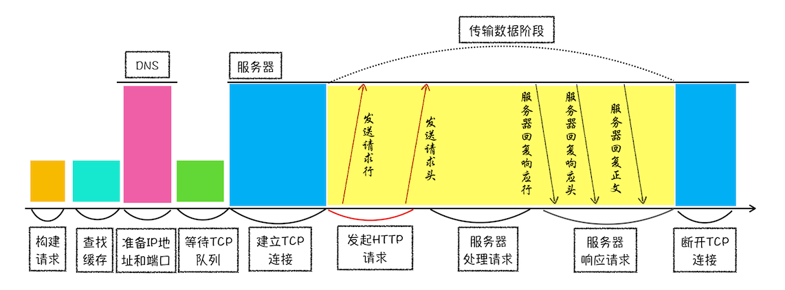
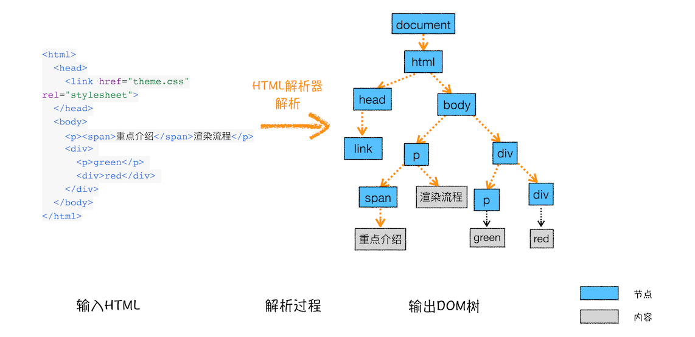
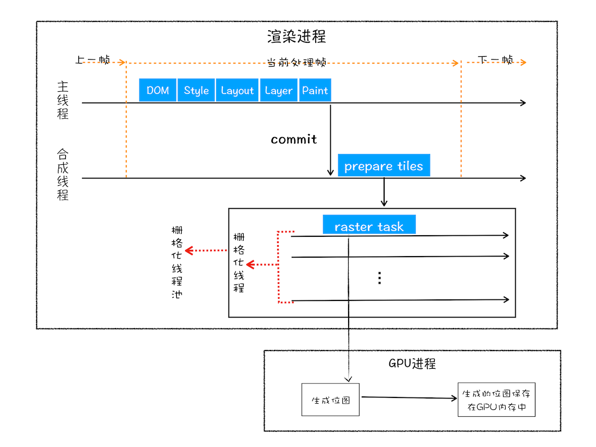

# 浏览器工作原理与实践笔记

[TOC]

## 进程和线程
- 关系：
  - 一个进程就是一个程序的运行实例。启动一个程序的时候，操作系统会为该程序创建一块内存，用来存放代码、运行中的数据和一个执行任务的主线程，我们把这样的一个运行环境叫进程。
  - 线程由进程来启动和管理的。线程依赖于进程，而进程中使用多线程并行处理能提升运算效率。
- 特点
  1. 进程中任意一线程执行出错，都会导致整个进程的崩溃
  2. 线程之间共享进程之中的数据
  3. 当一个进程关闭之后，操作系统会回收进程所占用的内存
  4. 进程之间内容互相隔离

## Chrome进程构架

- 浏览器进程。主要负责界面显示、用户交互、子进程管理，同时提供存储等功能。
- 渲染进程。核心任务是将 HTML、CSS 和 JavaScript 转换为用户可以与之交互的网页，排版引擎 Blink 和 JavaScript 引擎 V8 都是运行在该进程中，默认情况下，Chrome 会为每个 Tab 标签创建一个渲染进程。出于安全考虑，渲染进程都是运行在沙箱模式下。
- GPU 进程。其实，Chrome 刚开始发布的时候是没有 GPU 进程的。而 GPU 的使用初衷是为了实现 3D CSS 的效果，只是随后网页、Chrome 的 UI 界面都选择采用 GPU 来绘制，这使得 GPU 成为浏览器普遍的需求。最后，Chrome 在其多进程架构上也引入了 GPU 进程。
- 网络进程。主要负责页面的网络资源加载，之前是作为一个模块运行在浏览器进程里面的，直至最近才独立出来，成为一个单独的进程。
- 插件进程。主要是负责插件的运行，因插件易崩溃，所以需要通过插件进程来隔离，以保证插件进程崩溃不会对浏览器和页面造成影响。

## 浏览器端发起HTTP请求流程

1. 构建请求
2. 查找缓存
3. 准备 IP 地址和端口(DNS将域名转为IP)
4. 等待 TCP 队列(同一个域名同时最多只能建立 6 个 TCP 连接)
5. 建立 TCP 连接
6. 发送 HTTP 请求
1. 服务器返回请求
2. 断开连接

## 从输入 URL 到页面展示（导航过程）

1. 用户输入：判断是输入的关键字是搜索内容，还是请求的 URL。回车之后执行当前页面的`beforeunload`事件，显示loading状态。
    - 搜索内容：地址栏会使用浏览器默认的搜索引擎，来合成新的带搜索关键字的 URL。
    - URL：地址栏会根据规则，把这段内容加上协议，合成为完整的 URL。
2. URL 请求过程：浏览器进程会通过进程间通信（IPC）把 URL 请求发送至网络进程，网络进程接收到 URL 请求后，会在这里发起真正的 URL 请求流程。接下来流程参考[浏览器端发起 HTTP 请求流程](#浏览器端发起HTTP请求流程)
    1. 解析响应头：在导航过程中，如果服务器响应行的状态码包含了 301、302 一类的跳转信息，浏览器会跳转到新的地址重新发起请求；如果响应行是 200，那么表示浏览器可以继续处理该请求。
    2. 响应数据类型处理：从`Content-Type`中得知返回的数据类型。如果 Content-Type 字段的值被浏览器判断为下载类型，那么该请求会被提交给浏览器的下载管理器，同时该 URL 请求的导航流程就此结束。但如果是 HTML，那么浏览器则会继续进行导航流程。
3. 准备渲染进程：如果从一个页面打开了另一个新页面，而新页面和当前页面属于同一站点[^1]的话，那么新页面会复用父页面的渲染进程（process-per-site-instance策略）。否则分配新的渲染进程。
4. 提交文档
    - 首先当浏览器进程接收到网络进程的响应头数据之后，便向渲染进程发起“提交文档”的消息；
    - 渲染进程接收到“提交文档”的消息后，会和网络进程建立传输数据的“管道”，开始获取获取和解析页面；
    - 等文档数据传输完成之后，渲染进程会返回“确认提交”的消息给浏览器进程；
    - 浏览器进程在收到“确认提交”的消息后，会更新浏览器界面状态，包括了安全状态、地址栏的 URL、前进后退的历史状态，并更新 Web 页面。

[^1]:根域名和协议相同的网站定义为同一站点，包含该根域名下的所有子域名和不同的端口的网站。

## 渲染流程
1. 构建 DOM 树：通过 HTML 解析器将 HTML 解析成 DOM 树

  - 过程
    1. 通过分词器将 HTML 转换为 Token，使用安全检查模块（XSSAuditor）检测词法安全。Token 分为 Tag Token 和文本Token，Tag Token 又分 StartTag 和 EndTag。XSSAuditor 检查是否引用了外部脚本，是否符合 CSP 规范，是否存在跨站点请求等。如果出现不符合规范的内容，XSSAuditor 会对该脚本或者下载任务进行拦截。
    2. 将 Token 解析为 DOM 节点，并添加到 DOM 树中：HTML 解析器维护一个 Token 栈结构，读取到 StartTag Token 则压入栈，并创建对应的 DOM 节点添加到 DOM 树中；读取到文本 Token 则生成文本节点添加到 DOM 树中；读取到 EndTag Token，如果标签与栈顶元素相同则弹栈，表示元素解析完成。
  - 补充说明
    1. HTML 解析器开始工作时，会默认创建了一个根为 document 的空 DOM 结构。
    2. HTML 解析器是随着 HTML 文档边加载边解析的。
2. 样式计算（Recalculate Style）：计算出 DOM 节点中每个元素的具体样式
    1. 将 CSS 文本转换为 styleSheets；
    2. 转换样式表中的属性值，使其标准化。如`bold`转换为数值，`blue`转换为`rgb(0,128,0)`；
    3. 计算 DOM 树中每个节点的具体样式（根据继承和层叠规则）；
3. 布局阶段（Layout）：计算 DOM 树**可见元素**的位置
    1. 创建布局树：只包含可见元素；
    2. 计算布局：计算布局树节点的坐标位置
4. 分层：为特定节点生成图层树

    - 元素提升为单独层的条件：拥有层叠上下文属性；需要剪裁（元素中的文字超出元素大小时，文字单独作为一个层）
    - 如果一个节点没有对应的层，那么这个节点就从属于父节点的图层。
5. 图层绘制：把一个图层拆分为多个绘制指令，按顺序组成一个待绘制列表。
6. 分块：将图层划分为图块

7. 光栅化（raster）：合成线程将图块转换为位图
    - 视口附近的图块优先生成位图。
    - 渲染进程维护了一个栅格化的线程池，所有的图块栅格化都是在线程池内执行的。
    - 栅格化过程都会使用 GPU 来加速生成，使用 GPU 生成位图的过程叫快速栅格化，或者 GPU 栅格化，生成的位图被保存在 GPU 内存中。

8. 合成和显示：合成线程发送绘制图块的命令 DrawQuad 给浏览器进程。浏览器进程根据 DrawQuad 命令将其页面内容绘制到内存中，最后再将内存显示在屏幕上。

### JavaScript 对构建渲染流水的影响
- 内嵌和外部脚本的影响
  - HTML 中引用外部脚本：接收到 HTML 数据后，渲染引擎开启一个预解析线程，用来分析 HTML 文件中包含的 JavaScript、CSS 等相关文件，解析到相关文件之后，预解析线程会提前下载这些文件。构建 DOM 遇到脚本时，暂停 DOM 的解析，先等待文件下载完以及 CSSOM 生成（样式计算）完毕，然后执行脚本，执行完继续构建 DOM 树。
  
  - HTML 中内嵌脚本：与引用外部脚本相比少了下载 JavaScript 文件，构建 DOM 遇到脚本时，暂停构建，等待 CSS 文件下载以及 CSSOM 生成完毕，然后执行脚本，再继续构建 DOM 树。
- 优化（减少白屏时间）
  - 使用 CDN 来加速 JavaScript 文件的加载；
  - 内联 JS、CSS，减少文件下载；
  - 通过 webpack 等工具移除注释、压缩 JS，减少文件大小；
  - 通过媒体查询属性拆分大的 CSS 文件为几个不同用途的小文件；
  - 没有操作 DOM 相关代码的 JavaScript 文件设置为异步加载，通过 async 或 defer 来标记代码。

### 重排、重绘、合成
- 定义
  - 重排：更新元素的几何属性，触发重新布局，解析之后的一系列子阶段。
  
  - 重绘：更新元素的绘制属性，直接进入了绘制阶段，然后执行之后的一系列子阶段。
  
  - 合成：跳过布局和绘制，只执行后续的合成操作。
  
- 减少重绘、重排的方法：
  1. 使用 class 操作样式，而不是频繁操作 style
  2. 避免使用 table 布局
  3. 批量dom 操作，例如 createDocumentFragment，或者使用框架，例如 React
  4. Debounce window resize 事件
  5. 对 dom 属性的读写要分离
  6. will-change: transform 做优化

## 渲染进程的线程模型

## DevTools

### Network

- 下载信息概要：
  - DOMContentLoaded，这个事件发生后，说明页面已经构建好 DOM 了，这意味着构建 DOM 所需要的 HTML 文件、JavaScript 文件、CSS 文件都已经下载完成了。
  - Load，说明浏览器已经加载了所有的资源（图像、样式表等）。
- 时间线：
  1. Queueing：发起请求后排队等待执行；
  2. Proxy Negotiation：代理协商阶段，使用代理服务器时才有；
  3. Stalled：因某些原因连接过程被推迟；
  4. Initial connection/SSL：建立连接的阶段，包括建立 ssl 和 tcp 连接；
  5. Request sent：把请求发出去（不包含接收）；
  6. Waiting (TTFB)：第一字节时间，等待接收服务器第一个字节的数据的时间。TTFB 是反映服务端响应速度的重要指标，对服务器来说，TTFB 时间越短，就说明服务器响应越快。
  7. Content Download：从第一字节时间到接收到全部响应数据。
- 针对时间线的优化
  1. Queueing 时间过久：大概率是因为每个域名最多维护6个链接导致，可以使用域名分片技术，即将资源放在多个域名下面。或者将站点升级到 HTTP2，HTTP2 没有这个限制。
  2. TTFB 时间过久：
    - 服务器生成页面数据的时间过久：提高服务器处理速度，如增加缓存；
    - 网络的原因：使用cdn；
    - 发送请求头时带上了多余的用户信息：减少cookie的数据
  3. Content Download 时间过久：减少文件大小，如压缩、去掉注释等

## 拓展阅读
pac代理脚本、curl
[http缓存](https://developer.mozilla.org/zh-CN/docs/Web/HTTP/Caching_FAQ)
[层叠上下文](https://developer.mozilla.org/zh-CN/docs/Web/Guide/CSS/Understanding_z_index/The_stacking_context)